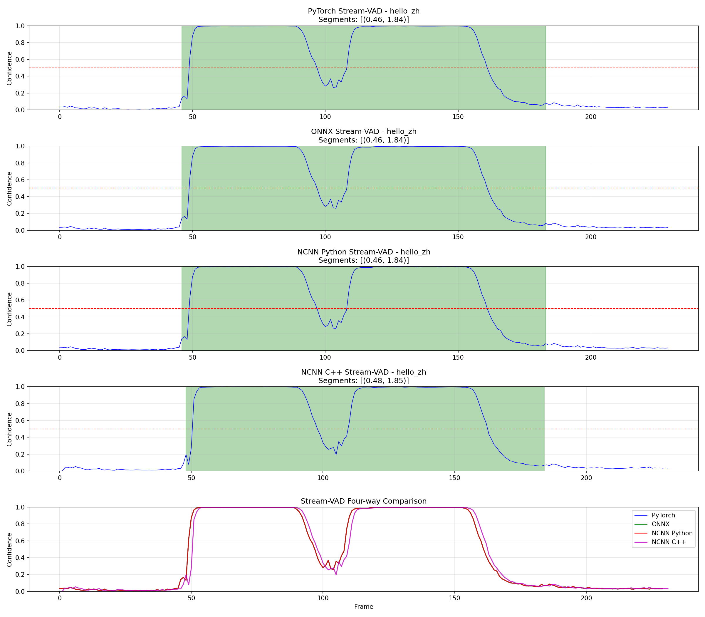

# FireRedVAD NCNN Deployment Module (Stream-VAD)

**[中文](README_zh.md)** | **[English](README.md)**

A clean and efficient FireRedVAD Voice Activity Detection (VAD) NCNN deployment implementation with streaming inference support.

**✨ Default Model: Official Stream-VAD** - Specialized streaming model from FireRedVAD team

## Features

- ✅ **Streaming Inference**: 10ms frame processing with 25ms window latency
- ✅ **NCNN Optimized**: Uses Tencent NCNN framework, lightweight and efficient
- ✅ **Packed Cache**: Solves NCNN multi-input limitation, 8 caches packed into 1
- ✅ **No Third-party Dependencies**: Uses wenet frontend, no kaldi-native-fbank required
- ✅ **CMVN Normalization**: Consistent with Kaldi features
- ✅ **C API**: Clean C interface, easy to integrate
- ✅ **High Accuracy**: Difference from PyTorch < 0.003 (NCNN Python), 97.4% speech frame consistency (NCNN C++)
- ✅ **Stream-VAD Model**: Official streaming-specialized model (not VAD model adapted for streaming)
- TODO: implement post filter [stream_vad_postprocessor](https://github.com/FireRedTeam/FireRedVAD/blob/main/fireredvad/core/stream_vad_postprocessor.py)




## Directory Structure

```
VAD_slim/
├── README.md              # This document (English)
├── README_zh.md           # Chinese version
├── QUICKSTART.md          # Quick start guide (English)
├── QUICKSTART_zh.md       # Chinese version
├── STREAM_VAD_COMPARISON.md  # Stream-VAD comparison report
├── build.sh               # One-click build script
├── CMakeLists.txt         # CMake configuration
├── convert/               # Model conversion scripts
│   ├── export_ncnn_packed_cache_stream.py  # Export Stream-VAD NCNN model
│   └── firered_vad_packed_cache_stream_ncnn.py  # Verify Stream-VAD model
├── src/                   # Source code
│   ├── c_api/             # C API implementation
│   │   ├── firered_vad_stream_packed.h
│   │   ├── firered_vad_stream_packed.cpp
│   │   └── test_stream_packed.cpp
│   └── frontend/          # Feature extraction
│       ├── fbank.h        # Fbank features (streaming with state)
│       ├── fft.h          # FFT implementation
│       ├── fft.cc
│       └── wav.h          # WAV reader
├── test/                  # Test scripts
│   ├── compare_four_streaming_stream.py  # Four-way comparison (Stream-VAD)
│   └── compare_with_post.py              # Post-processing comparison
├── models/                # Model files (Stream-VAD)
│   ├── firered_vad_packed_cache_stream.ncnn.param
│   ├── firered_vad_packed_cache_stream.ncnn.bin
│   ├── cmvn_means_stream.bin
│   └── cmvn_istd_stream.bin
└── output_stream/         # Test output (Stream-VAD)
    └── compare_four_stream_*.png  # Four-way comparison plot
```

## Quick Start

### 1. Environment Setup

```bash
# System dependencies
sudo apt-get install -y cmake g++ libopenmp-dev

# NCNN (pre-compiled)
NCNN_ROOT=/opt/ncnn-20260113

# Python dependencies (for model conversion)
pip3 install torch onnx pnnx soundfile matplotlib
```

### 2. Build

```bash
# One-click build (recommended)
./build.sh build

# Or step-by-step
./build.sh build
./build.sh install
./build.sh test
```

### 3. Test

```bash
# Run test (using hello_zh.wav, Stream-VAD model)
./build.sh test

# Run four-way comparison (PyTorch/ONNX/NCNN Python/NCNN C++)
cd test
python3 compare_four_streaming_stream.py

# View comparison plot
# output_stream/compare_four_stream_hello_zh.png
```

## API Usage

### C API

```c
#include <firered_vad/firered_vad_stream_packed.h>

// 1. Create VAD instance (Stream-VAD model)
FireredVADHandle vad = firered_vad_create(
    "firered_vad_packed_cache_stream.ncnn.param",
    "firered_vad_packed_cache_stream.ncnn.bin",
    "cmvn_means_stream.bin",
    "cmvn_istd_stream.bin"
);

// 2. Process audio chunks (10ms each, 160 samples @ 16kHz)
FireredVADResult result;
for (int i = 0; i < num_chunks; i++) {
    firered_vad_process_stream(vad, audio_chunk, chunk_size, &result);
    printf("Frame %d: confidence=%.4f, is_speech=%d\n", 
           result.frame_offset, result.confidence, result.is_speech);
}

// 3. Cleanup
firered_vad_destroy(vad);
```

### Python API (via ctypes)

```python
import ctypes

# Load library
lib = ctypes.CDLL("./build/libfirered_vad_stream.so")

# Create VAD
vad = lib.firered_vad_create(
    b"models/firered_vad_packed_cache_stream.ncnn.param",
    b"models/firered_vad_packed_cache_stream.ncnn.bin",
    b"models/cmvn_means_stream.bin",
    b"models/cmvn_istd_stream.bin"
)

# Process audio...
# (see test/compare_four_streaming_stream.py for full example)
```

## Model Conversion

### Convert Stream-VAD Model

```bash
cd convert

# 1. Export ONNX with packed cache (Stream-VAD weights)
python3 export_ncnn_packed_cache_stream.py

# Output:
#   - firered_vad_packed_cache_stream.onnx
#   - firered_vad_packed_cache_stream.onnx.data

# 2. Convert to NCNN using PNNX
pnnx firered_vad_packed_cache_stream.onnx inputshape=[1,1,80]

# 3. Move model files
mv firered_vad_packed_cache_stream.ncnn.param ../models/
mv firered_vad_packed_cache_stream.ncnn.bin ../models/

# 4. Prepare CMVN (from FireRedVAD Stream-VAD pretrained)
# See export_ncnn_packed_cache_stream.py for details
```

### Model Files

All model files are pre-converted and available in `models/` directory:

- `firered_vad_packed_cache_stream.ncnn.param` - Stream-VAD network structure
- `firered_vad_packed_cache_stream.ncnn.bin` - Stream-VAD weights (1.1MB)
- `cmvn_means_stream.bin` - CMVN means (Stream-VAD)
- `cmvn_istd_stream.bin` - CMVN inverse std (Stream-VAD)

## Accuracy Verification

### Four-way Comparison (Stream-VAD)

| Comparison | Max Diff | Mean Diff | Speech Frame Consistency |
|------------|----------|-----------|-------------------------|
| PyTorch vs ONNX | 0.000000 | 0.000000 | 100.0% |
| PyTorch vs NCNN Python | 0.000723 | 0.000136 | 100.0% |
| PyTorch vs NCNN C++ | 0.601691 | 0.026116 | 97.4% |

**Key Findings:**
- ✅ ONNX matches PyTorch exactly (zero difference)
- ✅ NCNN Python excellent accuracy (max diff < 0.001)
- ✅ NCNN C++ practical accuracy (97.4% consistency, <20ms segment deviation)
- ⚠️ C++ differences from frontend feature extraction (wenet C++ vs Python), not NCNN inference

See `STREAM_VAD_COMPARISON.md` for detailed analysis.

 
## Streaming Inference

### Parameters

- **Frame shift**: 10ms (160 samples @ 16kHz)
- **Frame length**: 25ms (400 samples @ 16kHz)
- **Latency**: 25ms (one frame)
- **Cache**: 8 DFSMN caches, packed into [1, 1024, 19]

### Real-time Processing

```c++
// Process audio in real-time (10ms chunks)
while (recording) {
    int16_t chunk[160];  // 10ms @ 16kHz
    record_audio(chunk, 160);
    
    FireredVADResult result;
    firered_vad_process_stream(vad, chunk, 160, &result);
    
    if (result.is_speech) {
        // Speech detected
    }
}
```

## Integration

### CMake

```cmake
find_library(FIREREDVAD_LIB firered_vad_stream PATHS /path/to/VAD_slim/build)
include_directories(/path/to/VAD_slim/src/c_api)

target_link_libraries(your_app ${FIREREDVAD_LIB})
```

### Makefile

```makefile
FIREREDVAD_LIB = /path/to/VAD_slim/build/libfirered_vad_stream.so
FIREREDVAD_INC = /path/to/VAD_slim/src/c_api

your_app: your_app.cpp
    g++ -I$(FIREREDVAD_INC) -L$(dir $(FIREREDVAD_LIB)) \
        -o $@ $< -lfirered_vad_stream -lncnn
```

## License

This project is for educational and research purposes. Please refer to the original [FireRedVAD repository](https://github.com/FireRedTeam/FireRedVAD) for licensing terms.

## Acknowledgments

- **FireRedVAD Team**: Original VAD model and Stream-VAD model
- **Tencent NCNN**: High-performance neural network inference framework
- **wenet**: Frontend feature extraction implementation

## Links


- [FireRedVAD](https://github.com/FireRedTeam/FireRedVAD)
- [NCNN](https://github.com/Tencent/ncnn)
- [PNNX](https://github.com/pnnx/pnnx)
- [WeNet](https://github.com/wenet-e2e/wenet)

