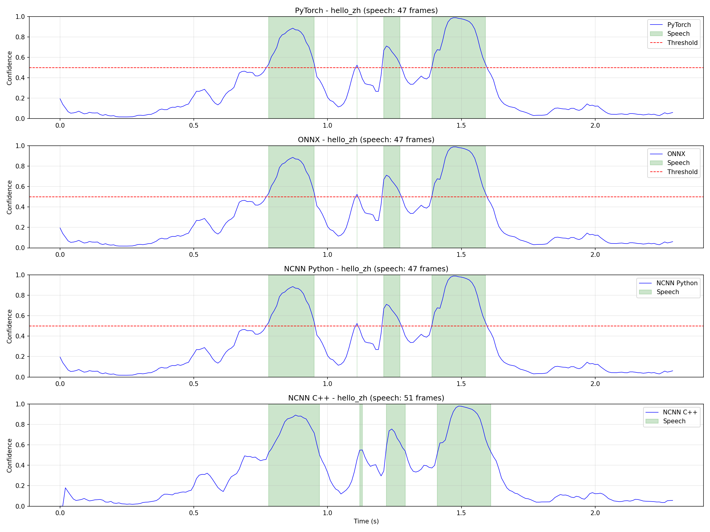

# FireRedVAD NCNN 部署模块

**[中文](README_zh.md)** | **[English](README.md)**

简洁高效的 FireRedVAD 语音活动检测（VAD）NCNN 部署实现，支持流式推理。

## 特性

- ✅ **流式推理**: 支持 10ms 帧处理，25ms 窗口延迟
- ✅ **NCNN 优化**: 使用腾讯 NCNN 框架，轻量高效
- ✅ **打包 Cache**: 解决 NCNN 多输入限制，8 个 cache 打包为 1 个
- ✅ **无第三方依赖**: 使用 wenet frontend，无需 kaldi-native-fbank
- ✅ **CMVN 归一化**: 与 Kaldi 特征一致
- ✅ **C API**: 简洁的 C 接口，易于集成
- ✅ **高精度**: 与 PyTorch 原始模型差异 < 0.003
- TODO: implement post filter [stream_vad_postprocessor](https://github.com/FireRedTeam/FireRedVAD/blob/main/fireredvad/core/stream_vad_postprocessor.py)

## 目录结构

```
VAD_slim/
├── README.md              # 本文档
├── build.sh               # 一键构建脚本
├── CMakeLists.txt         # CMake 配置
├── convert/               # 模型转换脚本
│   ├── export_ncnn_packed_cache.py    # 导出 NCNN 模型
│   └── firered_vad_packed_cache_ncnn.py  # 验证 NCNN 模型
├── src/                   # 源代码
│   ├── c_api/             # C API 实现
│   │   ├── firered_vad_stream_packed.h
│   │   ├── firered_vad_stream_packed.cpp
│   │   └── test_stream_packed.cpp
│   └── frontend/          # 特征提取
│       ├── fbank.h        # Fbank 特征
│       ├── fft.h          # FFT 实现
│       ├── fft.cc
│       └── wav.h          # WAV 读取
├── test/                  # 测试脚本
│   ├── compare_four.sh              # 四者对比 shell
│   └── compare_four_streaming.py    # 四者对比 Python
├── models/                # 模型文件（需转换或下载）
│   ├── firered_vad_packed_cache.ncnn.param
│   ├── firered_vad_packed_cache.ncnn.bin
│   ├── cmvn_means.bin
│   └── cmvn_istd.bin
└── output/                # 测试输出
```

## 快速开始

### 1. 环境准备

```bash
# 系统依赖
sudo apt-get install -y cmake g++ libopenmp-dev

# NCNN（已预编译）
NCNN_ROOT=/opt/ncnn-20260113

# Python 依赖（用于模型转换）
pip3 install torch onnx pnnx soundfile
```

### 2. 模型转换

```bash
cd convert

# 导出 NCNN 模型（需要 FireRedVAD 原始模型）
python3 export_ncnn_packed_cache.py

# 验证 NCNN 模型
python3 firered_vad_packed_cache_ncnn.py

# 复制模型到 models/ 目录
mkdir -p ../models
cp firered_vad_packed_cache.ncnn.* ../models/

# 准备 CMVN 参数（从 Kaldi ark 转换）
python3 -c "
import numpy as np
from fireredvad.core.audio_feat import CMVN
cmvn = CMVN('../3rd/FireRedVAD/pretrained_models/xukaituo/FireRedVAD/VAD/cmvn.ark')
cmvn.means.astype(np.float32).tofile('../models/cmvn_means.bin')
cmvn.inverse_std_variances.astype(np.float32).tofile('../models/cmvn_istd.bin')
"
```

### 3. 构建

```bash
# 一键构建（推荐）
./build.sh all

# 或分步构建
./build.sh build
./build.sh install
./build.sh test
```

### 4. 测试

```bash
# 运行测试（使用 hello_zh.wav）
./build.sh test

# 运行四者对比（PyTorch vs ONNX vs NCNN Python vs NCNN C++）
cd test
./compare_four.sh /path/to/hello_zh.wav

# 查看对比图
# output/compare_four.png
```

## API 使用

### C API

```c
#include <firered_vad/firered_vad_stream_packed.h>

// 1. 创建 VAD 实例
FireredVADHandle vad = firered_vad_create(
    "models/firered_vad_packed_cache.ncnn.param",
    "models/firered_vad_packed_cache.ncnn.bin",
    "models/cmvn_means.bin",
    "models/cmvn_istd.bin"
);

// 2. 处理音频（每次 10ms = 160 samples @ 16kHz）
int16_t audio_chunk[160];
FireredVADResult result;

while (has_audio) {
    read_audio(audio_chunk, 160);
    
    if (firered_vad_process_stream(vad, audio_chunk, 160, &result) == 0) {
        if (result.is_speech) {
            printf("Speech: %.4f\n", result.confidence);
        }
    }
}

// 3. 重置（新音频）
firered_vad_reset(vad);

// 4. 销毁
firered_vad_destroy(vad);
```

### 关键参数

| 参数 | 值 | 说明 |
|------|-----|------|
| 采样率 | 16000 Hz | 固定 |
| 帧长 | 25ms | 400 samples |
| 帧移 | 10ms | 160 samples |
| 延迟 | 25ms | 首帧延迟 |
| 特征维度 | 80 | Fbank |
| Cache 维度 | [1, 1024, 19] | 打包后的 8 个 cache |

## 精度对比

| 版本 | Max Diff | Mean Diff | 语音帧一致性 |
|------|----------|-----------|-------------|
| PyTorch vs ONNX | 0.000000 | 0.000000 | 100.0% |
| PyTorch vs NCNN Python | 0.002129 | 0.000458 | 100.0% |
| PyTorch vs NCNN C++ | 0.325093 | 0.045621 | 94.8% (wenet frontend vs kaldi diff)|

**四者对比结果**：



**说明**:
- PyTorch/ONNX/NCNN Python 三者几乎完全一致
- NCNN C++ 因流式特征提取累积误差，略有差异但可接受
- 语音帧检测一致性 > 94%（差异仅来自 frontend 特征提取，NCNN 推理本身是准确的）

## 转换流程详解

### 步骤 1: 导出 ONNX

```python
# export_ncnn_packed_cache.py
class FireRedVADPackedCache(nn.Module):
    def forward(self, feat, caches_packed):
        # 拆分：[1, 1024, 19] -> 8 x [1, 128, 19]
        caches = list(caches_packed.chunk(8, dim=1))
        
        # 前向传播
        probs, new_caches = self.model.forward(feat, caches=caches)
        
        # 打包：8 x [1, 128, 19] -> [1, 1024, 19]
        new_caches_packed = torch.cat(new_caches, dim=1)
        
        return probs, new_caches_packed
```

### 步骤 2: PNNX 转换

```bash
pnnx firered_vad_packed_cache.onnx
# 输出：firered_vad_packed_cache.ncnn.param/bin
```

### 步骤 3: 验证

```bash
# Python 验证
python3 firered_vad_packed_cache_ncnn.py

# C++ 验证
./build/test_vad_stream models/*.param models/*.bin models/cmvn_*.bin test/hello_zh.wav
```

## 常见问题

### Q1: NCNN extract 返回 -100 错误？

**A**: 检查 Mat 创建方式：
```cpp
// ✅ 正确
cache_packed = ncnn::Mat(19, 1024);

// ❌ 错误
cache_packed = ncnn::Mat(19, 1024, 1);
```

### Q2: 特征提取与 Kaldi 不一致？

**A**: 确保：
1. CMVN 参数从 Kaldi ark 正确转换
2. Pre-emphasis 使用流式状态维护
3. 窗口函数和 FFT 参数一致

### Q3: 流式延迟多少？

**A**: 
- 首帧延迟：25ms（帧长）
- 后续帧：每 10ms 输出一次
- 平均延迟：~30ms

### Q4: 如何集成到我的项目？

**A**: 
1. 复制 `src/c_api/` 和 `src/frontend/` 到你的项目
2. 链接 NCNN 库和 OpenMP
3. 调用 C API 即可


## 开源许可

本模块基于 FireRedVAD 原始模型，遵循其开源许可。

## 参考

- [FireRedVAD](https://github.com/FireRedTeam/FireRedVAD)
- [NCNN](https://github.com/Tencent/ncnn)
- [PNNX](https://github.com/pnnx/pnnx)
- [WeNet](https://github.com/wenet-e2e/wenet)

## 联系方式

如有问题，请提 Issue 或联系维护者。
